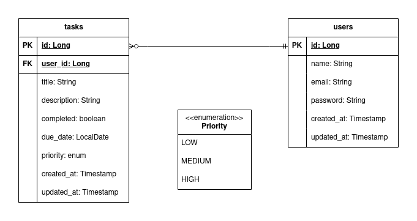

# Taskify API

API REST de gerenciamento de tarefas com autenticação JWT, desenvolvida com Java e Spring Boot.

## Objetivo

Um projeto de portfólio focado em demonstrar boas práticas de desenvolvimento backend com Java e Spring Boot: 
autenticação stateless com JWT, persistência com JPA e Flyway, documentação com OpenAPI e 
cobertura de testes unitários básicos com JUnit 5 e Mockito.

## Funcionalidades

- Autenticação JWT - Registro e login com tokens stateless
- CRUD de Tarefas - Gerenciamento completo com status e prioridade
- Isolamento por Usuário - Cada usuário vê apenas suas tarefas
- Validações - Título obrigatório, data futura, status válido
- Auditoria - Campos createdAt e updatedAt automáticos
- Logs Estruturados - Monitoramento de operações e erros

## Tecnologias

* Java 21
* Spring Boot 3
* Spring Security com JWT
* PostgreSQL 
* Flyway
* Docker + Docker Compose
* Spring Data JPA + Hibernate
* SpringDoc OpenAPI + Scalar UI
* JUnit 5 + Mockito (testes unitários básicos)

## Modelagem

## Endpoints

### Autenticação

| Método | Rota                 | Descrição             |
|--------|----------------------|-----------------------|
| POST   | `/api/auth/register` | Registra novo usuário |
| POST   | `/api/auth/login`    | Login, retorna JWT    |

### Perfil

| Método | Rota              | Descrição                              |
|--------|-------------------|----------------------------------------|
| GET    | `/api/profile/me` | Busca perfil do usuário autenticado    |
| PATCH  | `/api/profile/me` | Atualiza parcialmente dados do usuário |
| DELETE | `/api/profile/me` | Deleta conta                           |

### Tarefas

| Método | Rota                              | Descrição                                 |
|--------|-----------------------------------|-------------------------------------------|
| POST   | `/api/tasks`                      | Cria uma nova tarefa                      |
| GET    | `/api/tasks`                      | Lista tarefas do usuário autenticado      |
| GET    | `/api/tasks/{id}`                 | Busca tarefa por ID                       |
| PATCH  | `/api/tasks/{id}`                 | Atualiza parcialmente dados de uma tarefa |
| PATCH  | `/api/tasks/{id}/toggle-complete` | Alterna status da tarefa                  |
| DELETE | `/api/tasks/{id}`                 | Remove uma tarefa                         |

Documentação interativa disponível em (inserir link depois)

## Regras de Negócio

* Usuário só pode visualizar, editar e deletar suas próprias tarefas
* Tentativa de acessar tarefa de outro usuário retorna `403 Forbidden`
* E-mail deve ser único no sistema
* Título da tarefa é obrigatório
* JWT expira em 15 minutos; não há refresh token ainda (stateless)
* Senha armazenada com hash BCrypt

## O que aprendi

Este projeto foi construído com foco em aprendizado. Abaixo estão os principais conceitos que estudei e implementei.

### Autenticação com Spring Security e JWT

Essa foi a parte mais densa do projeto. Antes de implementar, precisei entender o que o Spring Security 
faz por padrão e onde eu precisava intervir.

#### O fluxo

**Registro**

O usuário envia nome, e-mail e senha. A senha nunca é armazenada em texto puro, ela passa pelo **BCryptPasswordEncoder** antes de ser salva. 
O **BCrypt** gera um hash diferente a cada chamada,mesmo para a mesma senha, o que garante que dois usuários com a mesma senha tenham hashes distintos no banco.

**Login**

O usuário envia e-mail e senha. O Spring Security compara a senha enviada com o hash armazenado via `passwordEncoder.matches()`. 
Se válido, o JwtService gera um token assinado com uma chave secreta contendo o e-mail do usuário como subject e um tempo de expiração de 15 minutos.

**Requisição autenticada**

Depois disso, o cliente envia o token no header de cada requisição:

Exemplo: `Authorization: Bearer eyJhbGcddfsdwaq...`

Antes de qualquer controller ser acionado, o `JwtAuthenticationFilter` intercepta a requisição, extrai o token do header, 
valida a assinatura e a expiração, carrega o usuário do banco e popula o `SecurityContextHolder` com a identidade autenticada.

Se o token for inválido ou ausente, o filtro não popula o contexto e o Spring Security retorna `401 Unauthorized` automaticamente.

---

#### Decisões que tomei

**Sem refresh token por enquanto**: Optei por manter simples. O token expira em 15 minutos e o usuário precisa fazer login novamente. 
Para o meu projeto achei que isso é suficiente para demonstrar o mecanismo.

**Stateless**: O servidor não guarda sessão. Cada requisição carrega sua própria identidade no token. Isso facilita escalabilidade horizontal.

**Chave secreta via variável de ambiente**: a JWT_SECRET nunca está hardcoded no código. Aprendi que colocar segredos no código é um erro grave, qualquer commit expõe a chave no histórico do Git.

---

### Persistência e migrations

Aprendi a não usar `ddl-auto: create` em projetos reais. O Flyway garante que o schema evolua de forma controlada e versionada,
cada alteração no banco é um script SQL numerado (V1__, V2__, etc) que pode ser rastreado no Git e reproduzido em qualquer ambiente.

A auditoria automática (createdAt, updatedAt) foi configurada via **Spring Data Auditing** com `@EnableJpaAuditing`, `@CreatedDate` 
e `@LastModifiedDate`. Isso eliminou a necessidade de setar essas datas manualmente em cada operação.

---

### Testes unitários com JUnit 5 e Mockito
Antes deste projeto, nunca tinha escrito testes de verdade. O que aprendi:

* **Como testar services com Mockito**: Isolar a camada de serviço mockando o repositório com `@Mock` e `@InjectMocks`, 
sem precisar subir o contexto Spring `@ExtendWith(MockitoExtension.class)`.

* **Como testar exceções:** usar `assertThrows()` para verificar que o serviço lança a exceção certa no cenário de erro.

* **Como verificar interações**: Usar `verify()` para confirmar que o repositório foi ou não foi chamado, por exemplo,
garantir que `save()` nunca é chamado quando a validação falha.

* **O que não testar**: métodos triviais de getter/setter, lógica do framework. O foco foi nas regras de negócio e nos caminhos de erro.

* **Como testar regras de negócio**: O caso mais importante foi o isolamento de tarefas entre usuários, o teste confirma que 
tentar acessar a tarefa de outro usuário lança 403, sem precisar de uma requisição HTTP real.

### Outras práticas que consolidei

* **DTOs de request e response**: Nunca expor a entidade diretamente na API. O DTO controla exatamente o que entra 
e o que sai, sem vazar campos como, por exemplo, senha do usuário.

* **Exceções customizadas com GlobalExceptionHandler**: Centralizar o tratamento de erros em um `@RestControllerAdvice` mantém os controllers limpos e as respostas de erro padronizadas.

* **Variáveis de ambiente com .env**: configuração separada do código. O `.env.example` no repositório documenta o que é necessário sem expor valores reais.

* **Logs estruturados**: logar eventos importantes (ex: criação de tarefa, tentativa de acesso não autorizado) com nível adequado (DEBUG, INFO, WARN) para facilitar observabilidade.

## Autora

### Jamilly Ferreira - [Linkedin](https://www.linkedin.com/in/jamillyferreira/) | [GitHub](https://github.com/jamillyferreira)